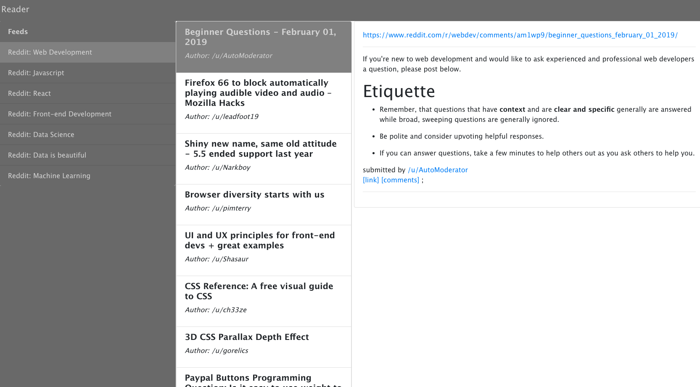

# reader-react

Basic feed reader interface to be used in future projects

## Motivation

I noticed that several of the projects I have plans to work on shared a common base interface. One or two columns on the left with list{s} in the columns and a content area on the right. (Similar to a text editor or email interface.) So I created this simple reader interface as a template to be used for later projects. If I find that I use this interface a lot I may create a fork of crete-react-app that uses this base template.

## Basic Architecture

The base reader interface is built using React and Redux along with the Reactstrap UI component library

## Screenshot

